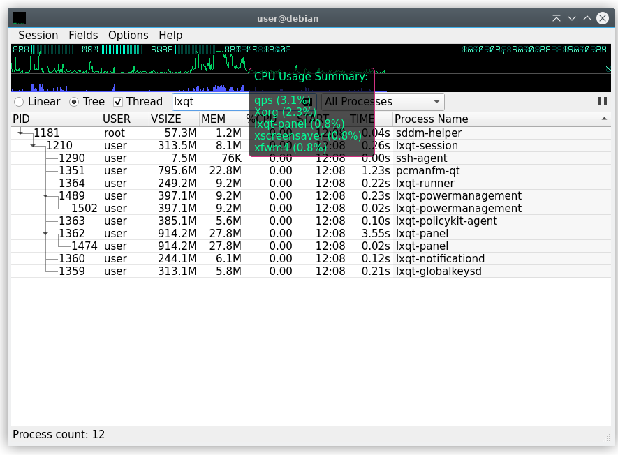

## Qt Process Manager

### Building

Requirements:
* Qt 5.15 or above
* [lxqt-build-tools](https://github.com/lxqt/lxqt-build-tools)
* [liblxqt](https://github.com/lxqt/liblxqt)

### License

Qps is licensed under the terms of the
[GPLv2](http://choosealicense.com/licenses/gpl-2.0/) or any later version.

### Binary packages

Official binary packages are provided by most major Linux and BSD distributions.
Just use your package manager to search for string `qps`.

### Translation

Translations can be done in [LXQt-Weblate](https://translate.lxqt-project.org/projects/lxqt-desktop/qps/)

